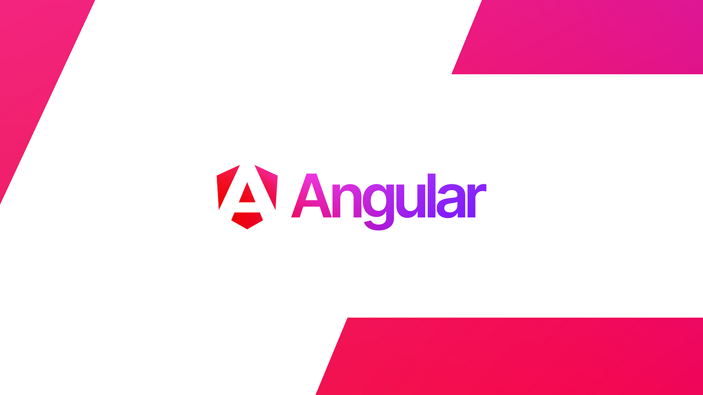
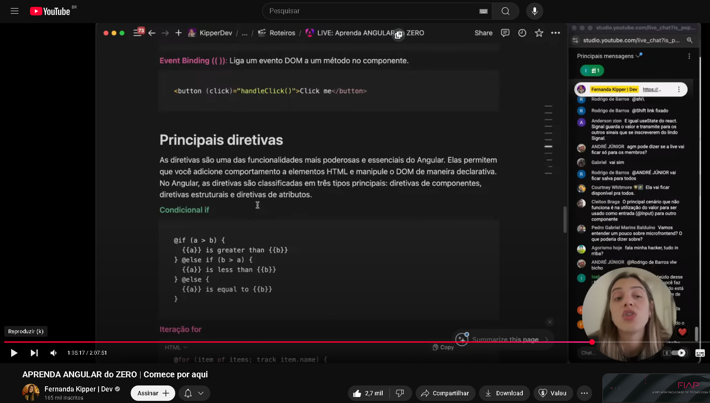

# 📕  Angular do ZERO  

Repositório criado para documentar meu aprendizado em **Angular**, com exemplos práticos e anotações sobre os principais conceitos dentro no notion.  

---
##  Referência de estudo

Durante meus estudos, utilizei esse aulão da Fernanda Kipper no YouTube como base:

- [Aulão - Fernanda Kipper](https://www.youtube.com/live/e4OLH13mVKc)
- [Minhas Anotações](https://ruddy-politician-b1d.notion.site/ANGULAR-KipperDev-251df6f285d3809397c2e6d5da65ba49)
<p align="center">
  
</p>

## 📑 Conteúdo do Repositório  

### 🔹 CriandoComponenteComStandalone  
- Primeiro contato com **Standalone Components**.  
- Como criar componentes independentes sem precisar de `NgModule`.  

### 🔹 HTTP-Angular/HTTP  
- Integração com **HttpClient**.  
- Uso de **RxJS** para tratar respostas e erros.  

### 🔹 PrincipaisDiretivas/AprendendoSobreEffects  
- Exploração das principais diretivas do Angular (`*ngIf`, `*ngFor`).  
 

### 🔹 StandaloneVsNgModules  
- Comparativo entre a abordagem tradicional com **NgModules** e a moderna com **Standalone Components**.  
- Quando usar cada um e como migrar.  

---

## Estrutura do projeto

```bash 

src/: Contém todo o código fonte da aplicação.

app/: Diretório principal da aplicação onde os componentes, serviços e módulos são organizados.

assets/: Diretório para armazenar arquivos estáticos, como imagens e fontes.

environments/: Contém arquivos de configuração para diferentes ambientes (desenvolvimento, produção, etc.).

main.ts: Arquivo de entrada principal que inicializa o módulo principal da aplicação.

index.html: Página HTML principal, onde o aplicativo Angular é carregado.

styles.css: Arquivo de estilos globais da aplicação.

angular.json: Arquivo de configuração do Angular CLI, que define como o projeto é construído e servido.

package.json: Lista as dependências do projeto e scripts de build.

```

## 🔹 Pré-requisitos  
- **Node.js** instalado 
- **Angular CLI** instalado globalmente
```bash
npm install -g @angular/cli

ng new meu-projeto

cd meu-projeto 

npm run start

```

neon kipper dev
---
